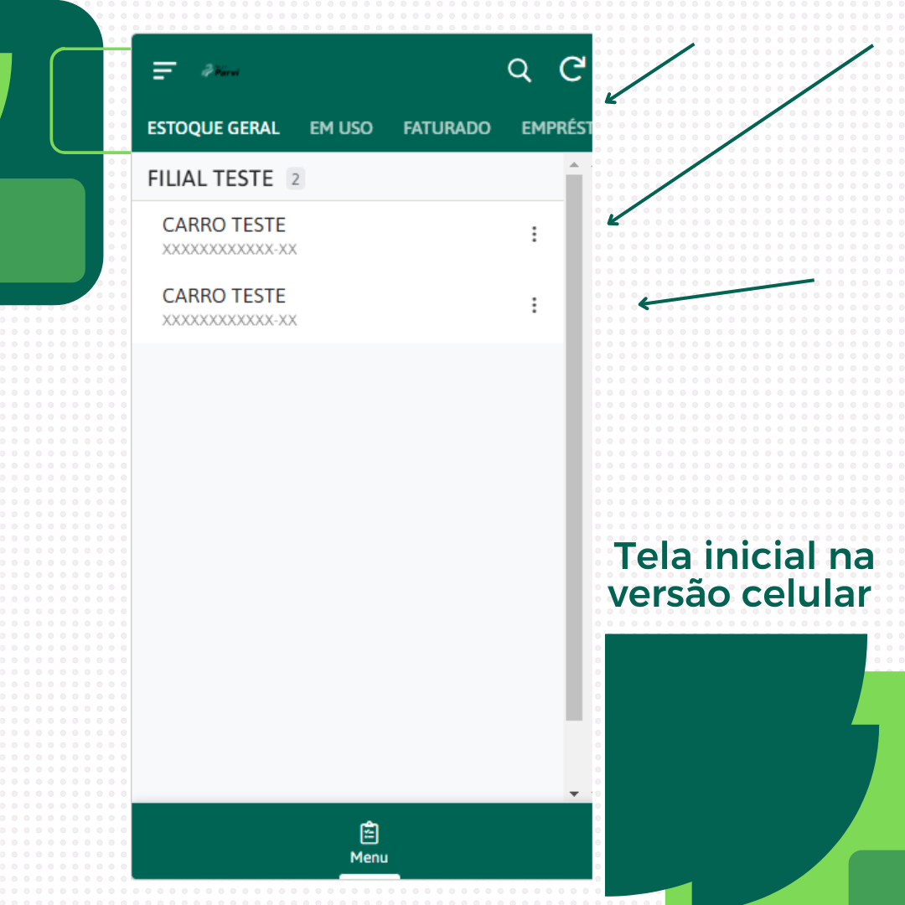
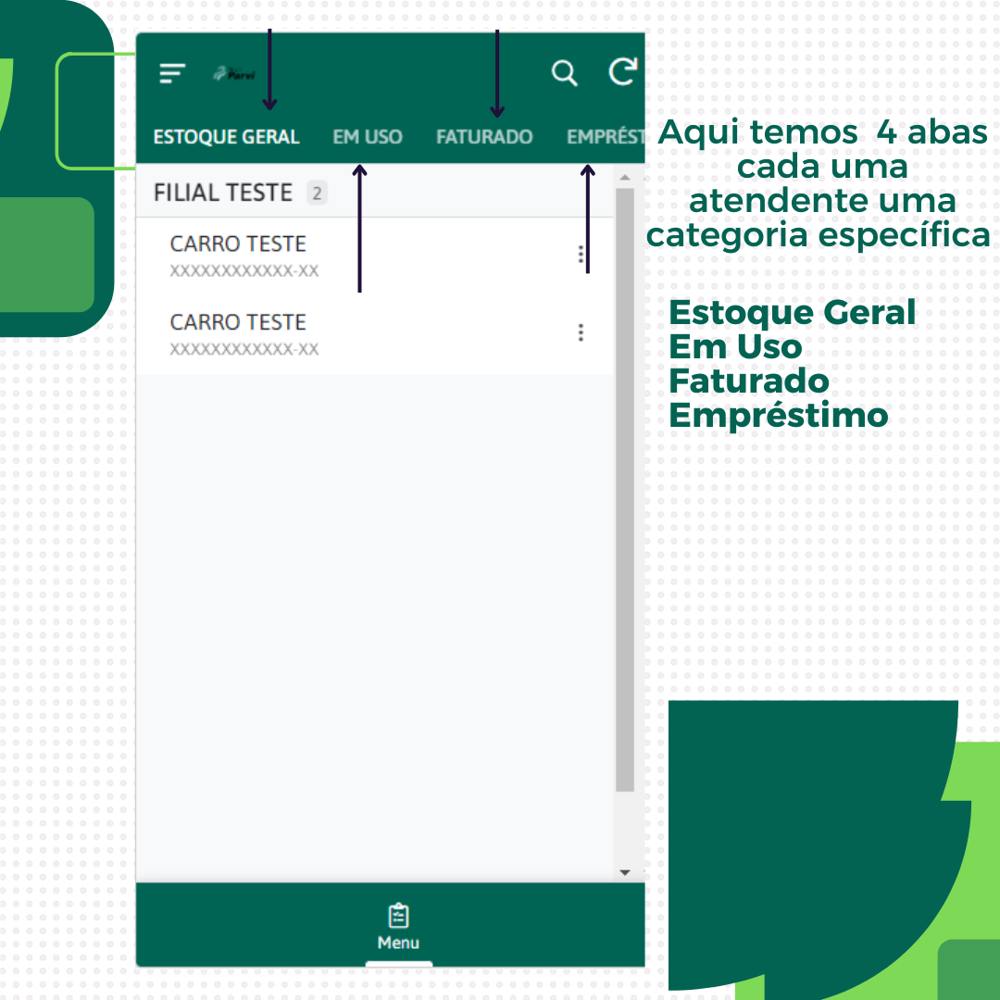
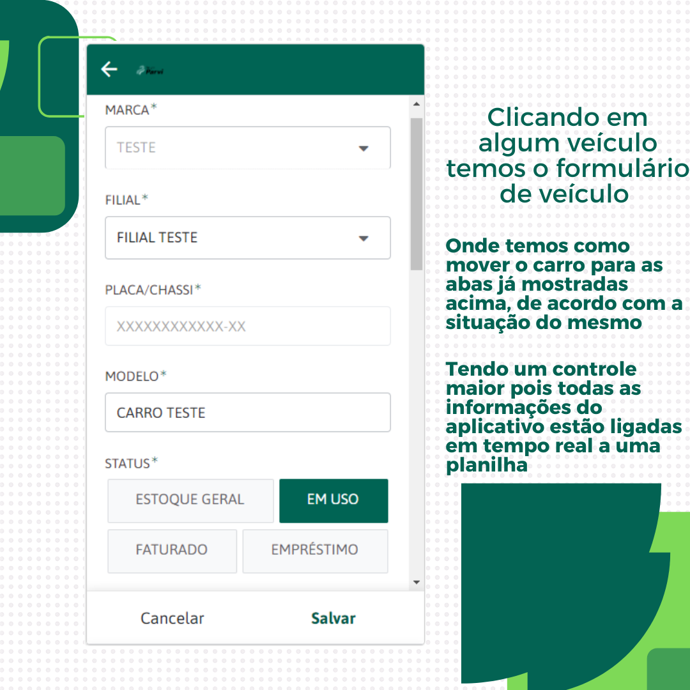

🚗 Aplicativo de Controle de Frotas — Parvi Auditoria

O Aplicativo de Controle de Frotas da Parvi Auditoria foi desenvolvido para transformar um processo que anteriormente era realizado de forma manual, por meio de planilhas, em uma solução digital integrada, dinâmica e altamente eficiente.

Antes da implantação do sistema, o controle dos veículos dependia de atualizações manuais, tornando o processo lento, suscetível a erros e com baixa confiabilidade das informações. A ausência de dados em tempo real dificultava a tomada de decisão, o acompanhamento do status da frota e a padronização dos registros.

Com o aplicativo, todo o controle da frota passou a ser centralizado em uma única plataforma, acessível via celular, tablet ou computador, garantindo mobilidade, flexibilidade e agilidade operacional. A interface foi projetada para ser simples, intuitiva e objetiva, permitindo uma gestão rápida e organizada dos veículos.

📊 Funcionalidades Principais

Centralização do controle de veículos em uma única plataforma

Acesso multiplataforma (mobile, tablet e desktop)

Atualização do status dos veículos em tempo real

Interface intuitiva e de fácil navegação

Redução de retrabalho e falhas humanas

Melhoria significativa na produtividade da equipe

Facilidade para auditorias e conferências

🗂️ Organização por Status

Na tela inicial, o sistema apresenta abas bem definidas que representam a situação atual de cada veículo:

Estoque Geral

Em Uso

Faturado

Empréstimo

Ao selecionar um veículo, o usuário acessa um formulário completo, onde é possível alterar seu status conforme a realidade operacional, garantindo maior controle, rastreabilidade e confiabilidade das informações.

🔄 Integração em Tempo Real

Um dos principais diferenciais do aplicativo é a integração em tempo real com a base de dados, eliminando divergências de informação e retrabalho. Qualquer atualização realizada no aplicativo reflete imediatamente na base de controle, assegurando padronização, agilidade e precisão nos dados.

🛠️ Tecnologias Utilizadas

AppSheet — Desenvolvimento da aplicação e interface

SQL — Estruturação e gerenciamento da base de dados

📷 Demonstração da Aplicação

Abaixo estão algumas telas do aplicativo, demonstrando o funcionamento em diferentes plataformas:

## 📷 Demonstração da Aplicação

### 📱 Versão Mobile

### 📱 Versão Tablet

### 💻 Versão Desktop

📦 Disponibilização

O aplicativo pode ser disponibilizado para testes diretamente na plataforma AppSheet.

📩 Entre em contato para receber uma cópia da aplicação e acessar o ambiente de demonstração.

📌 Considerações Finais

Este projeto representa um avanço significativo na gestão de frotas, substituindo um modelo manual e pouco eficiente por uma solução moderna, integrada e orientada à tomada de decisão, agregando valor operacional e estratégico ao processo.
